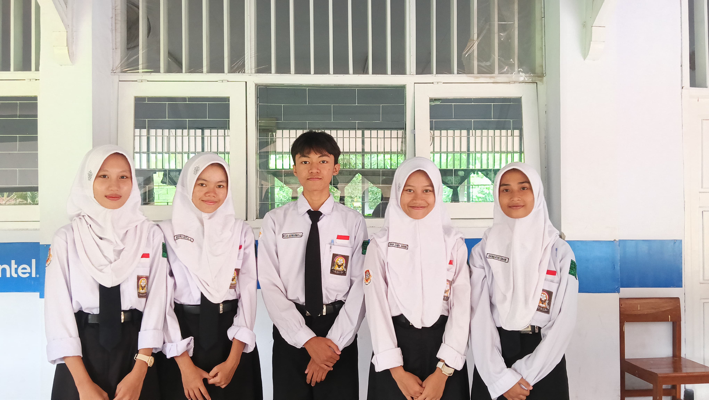

# Inventaris Barang Sarpras Sekolah

Aplikasi ini adalah sistem manajemen inventaris barang sarana dan prasarana untuk sekolah. Dibangun dengan Python dan SQLite sebagai database, aplikasi ini memudahkan pengelolaan peminjaman, pengembalian, dan pelacakan barang inventaris sekolah.

## Fitur

- **Manajemen Barang**: Tambah, edit, hapus, dan cari data barang inventaris  
- **Sistem Barcode**: Generate barcode unik untuk setiap barang  
- **Transaksi**: Peminjaman dan pengembalian barang oleh guru/staff  
- **Laporan**: Export data ke PDF dan JSON  
- **Notifikasi**: Peringatan barang yang belum dikembalikan  
- **Manajemen Foto**: Upload foto barang untuk dokumentasi

## Teknologi yang Digunakan

- **Python**: Bahasa pemrograman utama  
- **Tkinter**: Untuk antarmuka grafis (GUI)  
- **SQLite**: Database penyimpanan lokal  
- **Pillow (PIL)**: Untuk manipulasi gambar  
- **python-barcode**: Generate barcode otomatis  
- **FPDF**: Untuk generate laporan PDF  
- **tkcalendar**: Input tanggal yang user-friendly
  

## Instalasi 


### Instalasi Menggunakan File Executable (.exe) :

Ikuti langkah-langkah berikut untuk menginstal dan menjalankan aplikasi:

#### 1. Unduh File yang Diperlukan
- Buka repository: [neezarpl1-Inventaris-Barang-Sarpras](https://github.com/neezarpl1/neezarpl1-Inventaris-Barang-Sarpras)
- Masuk ke folder `dist`, lalu klik pada file:
  - `InventarisSekolah.exe` → Klik **Download**
  - `inventaris.db` (jika tersedia) → Klik **Download**

#### 2. Jalankan Aplikasi
- Simpan file `InventarisSekolah.exe` dan `inventaris.db` dalam **folder yang sama**.
- Klik dua kali `InventarisSekolah.exe` untuk menjalankan aplikasi.
- Jika muncul peringatan dari Windows Defender, pilih **"Run anyway"** atau tambahkan pengecualian secara manual.

#### 3. Persyaratan Sistem (Opsional)
- Aplikasi dikompilasi untuk sistem operasi **Windows**.
- Pastikan sudah terinstal **.NET Framework** jika diminta.
- Tidak membutuhkan instalasi Python jika menggunakan file `.exe`.

### Instalasi dari Kode Sumber (Source Code) :

1. Clone repositori ini:
```bash
git clone https://github.com/neezarrpl1/neezarrpl1-Inventaris-Barang-Sarpras.git
````

2. Masuk ke direktori proyek:

```bash
cd neezarrpl1-Inventaris-Barang-Sarpras
```

3. Install dependensi yang diperlukan:

```bash
pip install -r requirements.txt
```

4. Jalankan aplikasi:

```bash
python src\inventaris_barang.py
```


### Panduan Penggunaan:

1. **Input Barang Baru**:

   * Buka tab "Input Barang"
   * Isi formulir (nama, jumlah, lokasi, kondisi)
   * Upload foto barang (opsional)
   * Barcode akan digenerate otomatis

2. **Peminjaman Barang**:

   * Buka tab "Transaksi" → "Peminjaman"
   * Pilih barang yang tersedia
   * Isi data peminjam dan tanggal pengembalian

3. **Pengembalian Barang**:

   * Buka tab "Transaksi" → "Pengembalian"
   * Pilih transaksi yang akan dikembalikan
   * Konfirmasi pengembalian

4. **Export Data**:

   * Buka tab "Import/Export"
   * Pilih format export (PDF atau JSON)

## Struktur Folder

```
neezarrpl1-Inventaris-Barang-Sarpras/
├── dist/                           # Folder untuk versi executable
│   └── InventarisSarpras.exe       # Aplikasi versi executable
├── src/                            # Kode sumber
│   └── inventaris_barang.py
├── assets/                         # Aset aplikasi
│   └── app.ico                     # Ikon aplikasi
├── requirements.txt                # Daftar dependensi
└── README.md                       # File ini
```

## Documentation

### 📸 Dokumentasi Aplikasi

### Flowchart Program


### Tampilan Tab Input Barang


### Tampilan Tab Cari Barang


### Tampilan Tab Import & Export


### Tampilan Tab Transaksi: Peminjaman


### Tampilan Tab Transaksi: Pengembalian


### Tampilan Tab Transaksi: Riwayat


---

### 👥 Dokumentasi Wawancara

### Kelompok

- Airin Yenita Putri (04)
- Jeisyika Keyla Salsabila (15)
- Dian Zahra Andini (08)
- Khomsatun Isnaini (16)
- Neezar Abdurrahman Ahnaf Abiyyi (26)



### Wawancara Kopsis


### Wawancara Sarpras Bawah


### Wawancara Honda

